# AXIOM — Offline GraphRAG Industrial Knowledge Platform
## Fully Offline PDF → Knowledge Graph → Hybrid Retrieval Pipeline

> ## ⚠️ Important — API Key Required (OpenRouter)
> The current setup is wired for **[OpenRouter](https://openrouter.ai/)** as the LLM provider for answer generation. Evaluators and reviewers **must bring their own OpenRouter API key** — no shared or embedded key ships with this repo. Everything else (parsing, OCR, chunking, embeddings, FAISS, Neo4j) runs 100% offline and free; only the final answer-generation step needs a key. See [Configure your API key](#4-configure-your-llm-api-key-required) below.

## Architecture

```

PDF
├── Type Detection (PyMuPDF) ─── Digital → direct text extraction
│                              └── Scanned → PaddleOCR (offline)
├── Text Cleaning (ftfy + regex + unicode normalization)
├── Document Structuring (Pages → Sections → Paragraphs)
├── Semantic Chunking (500 tokens, 70 overlap)
├── Entity Extraction (spaCy + regex patterns)
├── Relationship Extraction (subject → predicate → object triples)
├── FAISS Vector Index (sentence-transformers/all-MiniLM-L6-v2, 384-dim)
└── Neo4j Knowledge Graph (Document → Page → Section → Chunk → Entity)
│
Hybrid Retrieval: 0.6 × Semantic (FAISS) + 0.4 × Graph (Neo4j)
│
LLM Generation (OpenRouter, or local Ollama / Groq / OpenAI)

```

## ✨ Live Pipeline Visualizations

The app doesn't just process documents — it *shows* you the pipeline working, step by step, in real time over Server-Sent Events. Below is an animated preview of the same flow rendered live in the **Pipeline Visualizer** and **Query & Retrieval** tabs; open the app to watch it happen on your own documents.

### Ingestion: a document chunk flowing through the pipeline



Each glowing node lights up as the animated chunk reaches it, mirroring the real backend events streamed from `app/services/ingestion/pipeline.py` — upload → type detection → OCR/parse → clean → structure → classify → chunk → extract entities/relationships → embed into FAISS → write to the Neo4j graph.

### Querying: how a question becomes a cited answer



Watch the query token travel from question → embedding → FAISS semantic search → Neo4j graph expansion → hybrid re-ranking → cited context assembly → LLM generation, turning green once a grounded, source-cited answer comes back — the same sequence streamed live from `app/routers/query.py`.

> Both diagrams are self-contained animated SVGs (no external dependencies) — GitHub, VS Code, and any modern browser will render the motion natively. Source files: [`axiom/docs/assets/pipeline-ingestion-animation.svg`](axiom/docs/assets/pipeline-ingestion-animation.svg) and [`axiom/docs/assets/pipeline-query-animation.svg`](axiom/docs/assets/pipeline-query-animation.svg).

## Quick Start

### Prerequisites

- Python 3.11+
- Node.js 18+ and npm
- Docker Desktop (for Neo4j; optionally Redis and local Ollama)
- 8GB+ RAM
- An **OpenRouter API key** — see step 4 (required for LLM-generated answers)

### 1. Clone the repository

```bash
git clone <this-repo-url>
cd ET_Hack/axiom
```

### 2. Start Neo4j (knowledge graph)

```bash
docker compose up neo4j -d
```

This starts Neo4j Community on `bolt://localhost:7687` (browser UI at [http://localhost:7474](http://localhost:7474), default credentials `neo4j` / `axiom_password`, set in `docker-compose.yml`).

### 3. Install backend dependencies

```bash
cd backend
python -m venv .venv
.venv\Scripts\activate        # Windows
# source .venv/bin/activate   # macOS/Linux
pip install -r requirements.txt
```

### 4. Configure your LLM API key (required)

```bash
copy .env.example .env         # Windows
# cp .env.example .env         # macOS/Linux
```

Open `backend/.env` and set:

```env
LLM_PROVIDER=openai
OPENAI_API_KEY=sk-or-v1-your-own-openrouter-key-here
```

> **Get a key:** sign up at [openrouter.ai/keys](https://openrouter.ai/keys) and generate your own API key — it's free to create and has free-tier models available. **Do not use anyone else's key.** Without a key set, the pipeline still runs end-to-end (parsing, OCR, chunking, FAISS, Neo4j) but the final answer-generation step falls back to a plain context summary instead of a full LLM answer.
>
> Prefer to run fully offline instead? Set `LLM_PROVIDER=ollama` and start a local model — see step 7.

### 5. Start the backend

```bash
uvicorn app.main:app --host 0.0.0.0 --port 8000 --reload
```

### 6. Start the frontend

```bash
cd ../frontend
npm install
npm run dev
```

### 7. (Optional) Run a fully local/offline LLM instead of OpenRouter

```bash
docker compose up ollama -d
docker exec -it axiom-ollama-1 ollama pull llama3.1:8b
docker exec -it axiom-ollama-1 ollama pull nomic-embed-text
```

Then set `LLM_PROVIDER=ollama` in `backend/.env` — no API key needed for this path.

### 8. Open the UI

Navigate to [http://localhost:3000](http://localhost:3000/)

- **Pipeline Visualizer** — Upload a PDF and watch all 11 ingestion steps animate in real time
- **Query & Retrieval** — Ask questions and watch FAISS search, graph expansion, re-ranking, and LLM generation stream in live
- **Dashboard** — FAISS index stats, Neo4j node counts, document inventory, service status
- **Knowledge Graph** — Text search and semantic search across indexed documents

## Ingestion Pipeline (11 Steps)

| Step | Phase | Tool |
| --- | --- | --- |
| 1 | PDF Type Detection | PyMuPDF (digital vs scanned) |
| 2 | Document Parsing | PyMuPDF / pdfplumber |
| 3 | OCR Processing | PaddleOCR (primary) / Tesseract (fallback) |
| 4 | Text Cleaning | ftfy + regex + unicode normalization |
| 5 | Document Structuring | Custom (pages → sections → paragraphs) |
| 6 | Document Classification | Keyword pattern matching (7 categories) |
| 7 | Semantic Chunking | 500 tokens, 70 overlap, section-aware |
| 8 | Entity Extraction | spaCy NER + regex patterns |
| 9 | Relationship Extraction | Pattern matching + co-occurrence |
| 10 | Embedding + FAISS | sentence-transformers → FAISS IndexFlatIP |
| 11 | Neo4j Graph | Document → Page → Section → Chunk → Entity |

## Retrieval Pipeline (7 Steps)

| Step | Phase | Detail |
| --- | --- | --- |
| 1 | Query Analysis | Extract equipment tags, regulation refs, key terms |
| 2 | Query Embedding | sentence-transformers (all-MiniLM-L6-v2) |
| 3 | FAISS Search | Top-k semantic similarity search |
| 4 | Neo4j Expansion | Entity neighborhood traversal |
| 5 | Hybrid Re-Ranking | Score = 0.6 × Semantic + 0.4 × Graph |
| 6 | Context Assembly | Build prompt with source citations |
| 7 | LLM Generation | OpenRouter (default) — or Ollama (local) / Groq / OpenAI |

## Neo4j Graph Schema

```
Document -[HAS_PAGE]-> Page -[HAS_SECTION]-> Section -[HAS_CHUNK]-> Chunk
Chunk -[MENTIONS]-> Entity (Equipment, Personnel, Regulation, etc.)
Entity -[RELATED_TO]-> Entity
```

## API Endpoints

| Endpoint | Method | Description |
| --- | --- | --- |
| `/api/v1/ingest/document/stream` | POST | Upload with real-time SSE pipeline visualization |
| `/api/v1/ingest/document` | POST | Upload & process a document |
| `/api/v1/ingest/batch` | POST | Batch upload multiple documents |
| `/api/v1/query/ask/stream` | POST | Query with real-time retrieval step visualization |
| `/api/v1/query/ask` | POST | Ask a question, get AI answer with sources |
| `/api/v1/query/search` | POST | Search documents without answer generation |
| `/api/v1/graph/search` | POST | Search knowledge graph + FAISS metadata |
| `/api/v1/graph/search/semantic` | POST | Semantic vector search over FAISS |
| `/api/v1/graph/equipment/{tag}` | GET | Full equipment context from Neo4j |
| `/api/v1/graph/stats` | GET | Combined FAISS + Neo4j statistics |
| `/health` | GET | Health check |

## Tech Stack

| Component | Technology | Cost |
| --- | --- | --- |
| PDF Parsing | PyMuPDF + pdfplumber | FREE |
| OCR | PaddleOCR (primary) + Tesseract (fallback) | FREE |
| Text Cleaning | ftfy + regex + unicodedata | FREE |
| NLP | spaCy | FREE |
| Embeddings | sentence-transformers (all-MiniLM-L6-v2) | FREE |
| Vector DB | FAISS (offline, file-persisted) | FREE |
| Graph DB | Neo4j Community (Docker) | FREE |
| LLM | **OpenRouter (default, requires your own API key)** — or Ollama / Groq / OpenAI | Bring-your-own key |
| Backend | FastAPI + Uvicorn | FREE |
| Frontend | Next.js 16 + React 19 | FREE |

## Project Structure

```
axiom/
├── docker-compose.yml          # Neo4j + Ollama containers
├── docs/
│   └── assets/                 # README animated pipeline diagrams
├── backend/
│   ├── app/
│   │   ├── main.py             # FastAPI app with FAISS + Neo4j lifespan
│   │   ├── config.py           # Settings (chunk size, weights, paths)
│   │   ├── models/schemas.py   # Pydantic data models
│   │   ├── routers/
│   │   │   ├── ingest.py       # Upload + SSE streaming pipeline
│   │   │   ├── query.py        # RAG query + SSE streaming retrieval
│   │   │   └── graph.py        # Knowledge graph + FAISS search
│   │   └── services/
│   │       ├── ingestion/
│   │       │   ├── pipeline.py           # 11-step orchestrator
│   │       │   ├── pdf_parser.py         # PyMuPDF + DOCX parser
│   │       │   ├── ocr_engine.py         # PaddleOCR + Tesseract
│   │       │   ├── text_cleaner.py       # Noise removal, unicode
│   │       │   ├── document_structurer.py # Page/section hierarchy
│   │       │   ├── chunker.py            # Semantic chunking
│   │       │   ├── entity_extractor.py   # spaCy + regex NER
│   │       │   ├── relationship_extractor.py # Triple extraction
│   │       │   └── document_classifier.py # Category classification
│   │       ├── vectorstore/
│   │       │   └── faiss_service.py      # FAISS index + embeddings
│   │       ├── knowledge_graph/
│   │       │   ├── neo4j_client.py       # Neo4j async driver
│   │       │   └── graph_builder.py      # Document→Page→Chunk→Entity
│   │       └── rag/
│   │           ├── retriever.py          # Hybrid FAISS+Neo4j+BM25
│   │           └── generator.py          # OpenRouter/Ollama/Groq/OpenAI answer gen
│   └── data/
│       ├── faiss/                        # Persisted FAISS index
│       └── uploads/                      # Uploaded documents
└── frontend/
    └── src/app/
        ├── page.js             # Pipeline Visualizer + Query UI
        └── globals.css          # Dark theme styles
```
